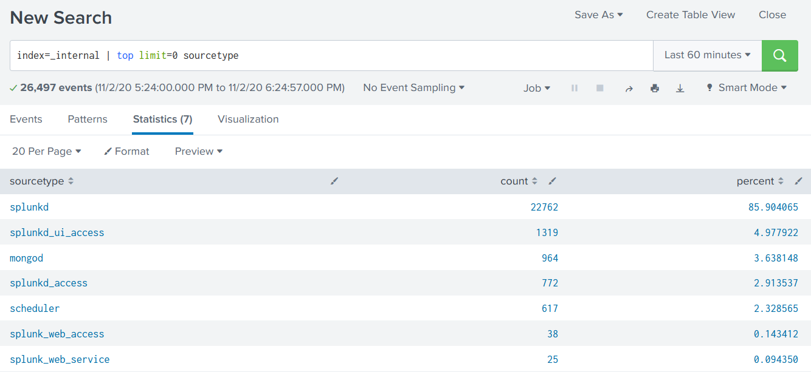
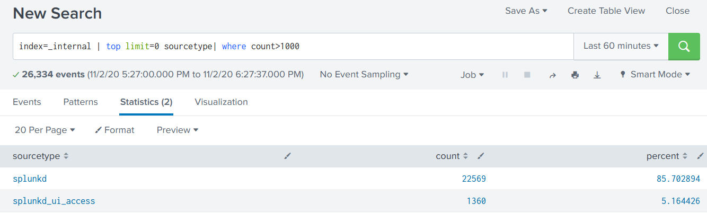

For a new feature in version 6.0 of uberAgent, we needed to run a few saved searches to do some calculations but let users modify input values.

Our requirements in detail:
 1. Run saved searches to calculate experience scores for machines, user sessions, and applications
 2. Provide defaults for thresholds and weights but let users configure them. Users might make modifications once or twice, but not daily. So we needed something easy to understand but nothing too fancy.
 3. Only administrators should modify settings that should be valid for all users accessing a particular Splunk app. It needed to be configurable, but not for everyone. A poor man's access control, so to say.

I explain below how we achieved that by using Splunk anywhere examples. That's probably easier to understand, and I don't have to explain every bit of uberAgent here 😉

## Saved Searches Accept Tokens
That was not clear to me but saved searches accept tokens. That's awesome as it's the foundation of our solution to our requirements: we can run saved searches configured by tokens, and only Splunk users with access to the disk can change them. Poor man's access control achieved!

Let's start with a simple search listing all source types in the index `_internal`.
```
index=_internal | top limit=0 sourcetype
```



Do the same but output only source types with a count greater than 1000.
```
index=_internal | top limit=0 sourcetype | where count>1000
```



The 1000 is the part you want to be configurable. Hence create the following saved search:
```ini
[im_accepting_tokens]
dispatch.earliest_time = -30m
dispatch.latest_time = now
search = index=_internal | top limit=0 sourcetype | where count>$TokenCount$
run_on_startup = false
enableSched  = 0
```

Note that 1000 is now `$TokenCount$`. That can be replaced dynamically by calling the saved search like so:
```
| savedsearch im_accepting_tokens TokenCount=500
```

## Using Lookups for Easy Token Management
Saved searches are stored in `savedsearches.conf`. Letting users change things directly there can be dangerous. Searches can get quite long and hard to read, and cron schedules are not for everybody.

Hence we wanted to pass tokens to saved searches more safely and, most importantly, more user-friendly.

A CSV lookup was the most convenient way we found. Everybody is more or less familiar with the syntax. And we are using them in uberAgent for several things, so it was just another one to manage.

### Creating a Lookup
Add the following to your `transforms.conf`.
```csv
[lookup_input_tokens]
filename = input_tokens.csv
```

Create the `input_tokens.csv` with the following content.
```csv
token,value
TokenCount,1000
```

If you need more tokens, add them below the `TokenCount` one.
```csv
token,value
TokenCount,1000
AnotherToken,"ABC"
AndAnotherOne,123
```

### Reading a Lookup as Input for a Saved Search
To read the content of your newly created lookup when running the saved search, call the saved search like the following:
```
| savedsearch im_accepting_tokens [ | inputlookup lookup_input_tokens | xyseries token token value | stats values(*) as * | fields - token]
````


 - `| inputlookup lookup_input_tokens` reads the lookup
 - `xyseries token token value` transforms the lookup. Everything in the `token` column gets a field with `value` as value.
   - Think of a table. `token` will be the column header and `value` an entry in a row for that column.
 - `| stats values(*) as *` removes all empty values (-> all fields in the table that are empty)
 - `| fields - token` removes the `token` field itself as its not a field we want to pass to the saved search
 
## Conclusion
We solved all our requirements with not too much effort. Users with sufficient permissions may change things by just editing a CSV file. Nice and easy!

I've to admit that using that method to pass one token is slightly overkill, but we had to pass a lot for maximum flexibility.

Happy Splunking!
